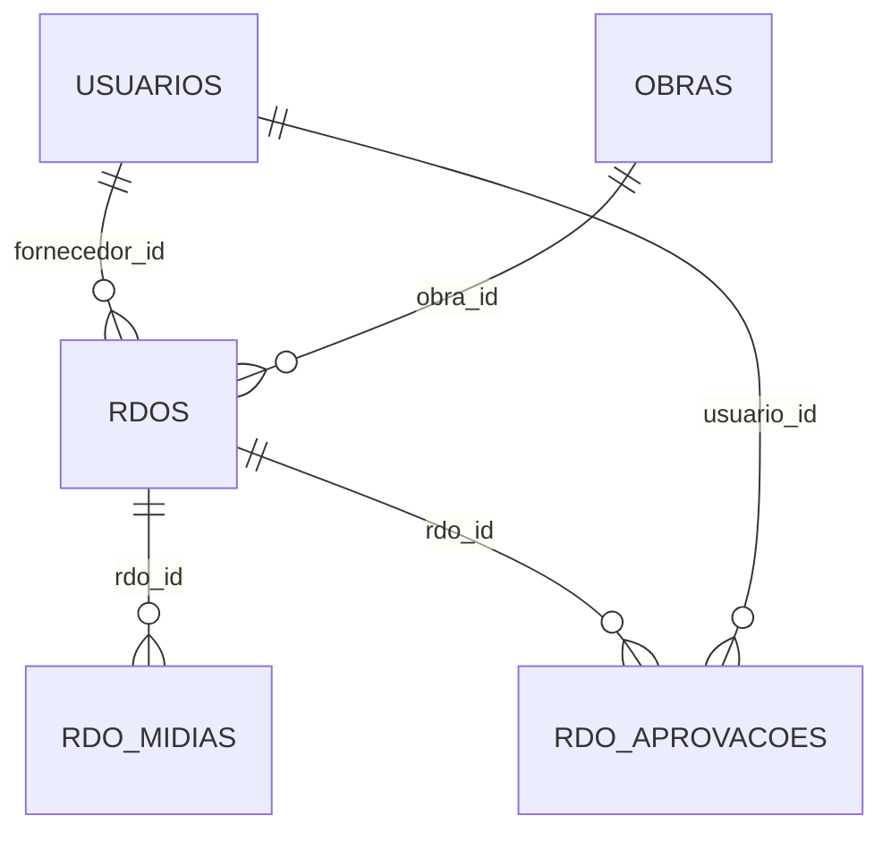
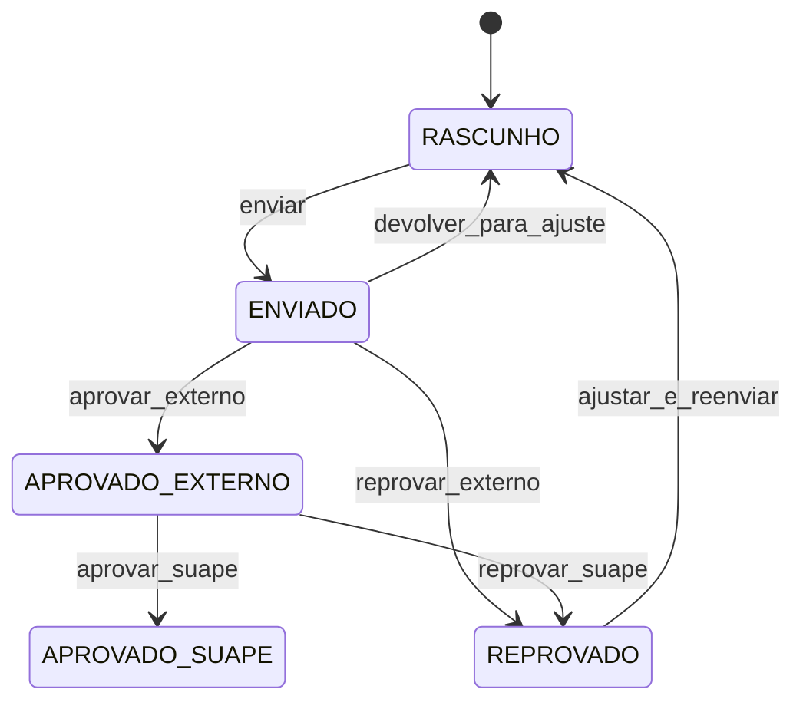

# MDD RDO SUAPE - Analise Completa Compativel com Banco Atual (sem codigo)

## Regra principal desta versao
- Esta modelagem e limitada ao schema SQL fornecido.
- Nao criar novas tabelas.
- Nao criar novos campos.
- Nao alterar enums fora dos valores existentes.

---

## 1) Compreensao do negocio (mantida)
- Registrar Diario de Obras (RDO) por obra.
- Permitir fluxo entre Fornecedor, Fiscal Externo e Fiscal SUAPE.
- Registrar aprovacoes com historico.
- Anexar midias e arquivos ao RDO.

Observacao de escopo:
- Recursos como auditoria detalhada, geolocalizacao e assinaturas digitais podem ser tratados em camada de aplicacao/processo, sem persistencia adicional neste momento, pois o banco atual nao possui campos dedicados.

---

## 2) Dominio alinhado ao banco atual

## Entidades persistidas
- Usuario -> tabela `usuarios`
- Obra -> tabela `obras`
- RDO -> tabela `rdos`
- RDOMidia -> tabela `rdo_midias`
- RDOAprovacao -> tabela `rdo_aprovacoes`

## Value Objects (conceituais, sem novos campos)
- PerfilUsuario: `FORNECEDOR | FISCAL_EXTERNO | FISCAL_SUAPE | ADMIN`
- StatusRDO: `RASCUNHO | ENVIADO | APROVADO_EXTERNO | APROVADO_SUAPE | REPROVADO`
- StatusAprovacao: `APROVADO | REPROVADO | DEVOLVIDO`
- TipoMidia: `FOTO | VIDEO | ANEXO`

## Agregados
1. RDO (Aggregate Root)
- Contem dados operacionais do diario e relaciona midias/aprovacoes.
- Justificativa: e o nucleo transacional do processo.

2. Obra (Aggregate Root)
- Delimita contexto contratual e endereco.
- Justificativa: agrupa os RDOs por escopo de execucao.

3. Usuario (Aggregate Root)
- Representa ator do processo com perfil fixado no enum.
- Justificativa: identidade e autorizacao basica.

## Relacionamentos
- `obras (1) -> (N) rdos` por `rdos.obra_id`
- `usuarios (1) -> (N) rdos` por `rdos.fornecedor_id`
- `rdos (1) -> (N) rdo_midias` por `rdo_midias.rdo_id`
- `rdos (1) -> (N) rdo_aprovacoes` por `rdo_aprovacoes.rdo_id`
- `usuarios (1) -> (N) rdo_aprovacoes` por `rdo_aprovacoes.usuario_id`

### ER Mermaid (fiel ao schema)

---

## 3) Regras de negocio remapeadas para os enums existentes

## Perfis e acesso (por aplicacao)
- `ADMIN`: gerencia usuarios/obras e visao total.
- `FORNECEDOR`: cria e edita RDO enquanto status permitir.
- `FISCAL_EXTERNO`: aprova/reprova/devolve no contexto externo.
- `FISCAL_SUAPE`: aprova/reprova na etapa SUAPE.

## Fluxo de status do RDO (somente status existentes)
Transicoes validas sugeridas:
- `RASCUNHO -> ENVIADO`
- `ENVIADO -> APROVADO_EXTERNO`
- `ENVIADO -> REPROVADO`
- `ENVIADO -> RASCUNHO` (quando houver devolucao para ajuste)
- `APROVADO_EXTERNO -> APROVADO_SUAPE`
- `APROVADO_EXTERNO -> REPROVADO`
- `REPROVADO -> RASCUNHO`

Observacao:
- Como nao existe status especifico "DEVOLVIDO" em `rdos.status`, a devolucao fica registrada em `rdo_aprovacoes.status = DEVOLVIDO` e o RDO retorna para `RASCUNHO`.

### State Machine Mermaid

---

## 4) Modelagem de dados (exatamente o schema atual)

## Tabela `usuarios`
- `id INT AUTO_INCREMENT` PK
- `nome VARCHAR(150)`
- `email VARCHAR(150)`
- `perfil ENUM('FORNECEDOR','FISCAL_EXTERNO','FISCAL_SUAPE','ADMIN')`

## Tabela `obras`
- `id INT AUTO_INCREMENT` PK
- `nome VARCHAR(150)`
- `contrato VARCHAR(100)`
- `endereco TEXT`

## Tabela `rdos`
- `id INT AUTO_INCREMENT` PK
- `obra_id INT` FK -> `obras.id`
- `fornecedor_id INT` FK -> `usuarios.id`
- `data_rdo DATE`
- `atividades TEXT`
- `equipe JSON`
- `equipamentos JSON`
- `comentarios TEXT`
- `clima VARCHAR(50)`
- `ocorrencias TEXT`
- `conclusao_etapa TEXT`
- `status ENUM('RASCUNHO','ENVIADO','APROVADO_EXTERNO','APROVADO_SUAPE','REPROVADO')` default `RASCUNHO`

## Tabela `rdo_midias`
- `id INT AUTO_INCREMENT` PK
- `rdo_id INT NOT NULL` FK -> `rdos.id`
- `tipo ENUM('FOTO','VIDEO','ANEXO')`
- `nome_arquivo VARCHAR(255)`
- `extensao VARCHAR(20)`
- `tamanho BIGINT`
- `caminho TEXT`
- `descricao TEXT`
- `criado_em DATETIME DEFAULT CURRENT_TIMESTAMP`

## Tabela `rdo_aprovacoes`
- `id INT AUTO_INCREMENT` PK
- `rdo_id INT` FK -> `rdos.id`
- `usuario_id INT` FK -> `usuarios.id`
- `status ENUM('APROVADO','REPROVADO','DEVOLVIDO')`
- `observacao TEXT`
- `criado_em DATETIME DEFAULT CURRENT_TIMESTAMP`

---

## 5) Casos de uso (compatibilizados)

1. Criar usuario (ADMIN)
2. Listar/editar usuario (ADMIN)
3. Cadastrar obra (ADMIN)
4. Criar RDO (FORNECEDOR)
5. Editar RDO em `RASCUNHO` (FORNECEDOR)
6. Enviar RDO (`RASCUNHO -> ENVIADO`) (FORNECEDOR)
7. Aprovar externo (`ENVIADO -> APROVADO_EXTERNO`) (FISCAL_EXTERNO)
8. Reprovar externo (`ENVIADO -> REPROVADO`) (FISCAL_EXTERNO)
9. Devolver externo (`ENVIADO -> RASCUNHO` + aprovacao `DEVOLVIDO`) (FISCAL_EXTERNO)
10. Aprovar SUAPE (`APROVADO_EXTERNO -> APROVADO_SUAPE`) (FISCAL_SUAPE)
11. Reprovar SUAPE (`APROVADO_EXTERNO -> REPROVADO`) (FISCAL_SUAPE)
12. Anexar midia ao RDO (FORNECEDOR/FISCAIS conforme regra)
13. Consultar historico de aprovacoes (todos com permissao)

---

## 6) API REST proposta (compativel com tabelas/colunas atuais)

Recursos:
- `/usuarios`
- `/obras`
- `/rdos`
- `/rdos/{id}/midias`
- `/rdos/{id}/aprovacoes`

Operacoes principais:
- `POST /usuarios`, `GET /usuarios`, `PUT /usuarios/{id}`
- `POST /obras`, `GET /obras`, `PUT /obras/{id}`
- `POST /rdos`, `GET /rdos`, `GET /rdos/{id}`, `PUT /rdos/{id}`
- `POST /rdos/{id}/enviar`
- `POST /rdos/{id}/aprovacoes`
- `POST /rdos/{id}/midias`, `GET /rdos/{id}/midias`

Mapeamento de payloads:
- RDO usa somente: `obra_id`, `fornecedor_id`, `data_rdo`, `atividades`, `equipe`, `equipamentos`, `comentarios`, `clima`, `ocorrencias`, `conclusao_etapa`, `status`.
- Midia usa somente campos de `rdo_midias`.
- Aprovacao usa somente campos de `rdo_aprovacoes`.

---

## 7) Seguranca (sem novos campos no banco)
- Autenticacao/autorizacao pode ser feita em camada de aplicacao (JWT/RBAC), sem alterar schema.
- Perfil de usuario deriva de `usuarios.perfil`.

---

## 8) Offline e sincronizacao (sem novos campos)
- Pode ser tratado por fila local no cliente.
- No servidor, aplicar idempotencia por regra de aplicacao (chave de requisicao em cache/processo), sem persistencia adicional no banco atual.

---

## 9) Relatorios (sem novos campos)
- Relatorio de RDO por obra e periodo usando `rdos`.
- Relatorio de aprovacoes por RDO usando `rdo_aprovacoes`.
- Relatorio de midias por RDO usando `rdo_midias`.

---

## 10) Entregaveis finais desta versao
1. Glossario minimo alinhado ao schema.
2. Diagrama de contexto (conceitual).
3. ER fiel ao banco atual.
4. State machine com enums existentes.
5. Matriz de perfis por acao.
6. Modelo relacional existente (sem extensao).
7. Casos de uso compatibilizados.
8. Especificacao OpenAPI 3.1 limitada aos campos existentes.
9. Arquitetura sugerida sem mudanca de schema.
10. Roadmap com evolucoes futuras opcionais fora desta baseline.

## Matriz de perfis (resumo)
| Acao | FORNECEDOR | FISCAL_EXTERNO | FISCAL_SUAPE | ADMIN |
|---|---|---|---|---|
| Criar/editar RDO em RASCUNHO | Sim | Nao | Nao | Sim |
| Enviar RDO | Sim | Nao | Nao | Sim |
| Aprovar/reprovar/devolver externo | Nao | Sim | Nao | Sim |
| Aprovar/reprovar SUAPE | Nao | Nao | Sim | Sim |
| Anexar midia | Sim | Sim | Sim | Sim |
| Gerenciar usuarios/obras | Nao | Nao | Nao | Sim |
